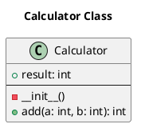
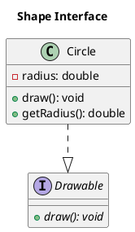

# DiagramGenerationAgent Tests Summary

## 📋 Tổng quan

Đã tạo comprehensive test suite cho `DiagramGenerationAgent` với **3 test files chính** và **50+ test cases** covering tất cả functionality.

## 🧪 Test Files Created

### 1. `test_diagram_generator_plantuml.py` - Specialized PlantUML Tests
**13 test cases** với sample ASTs và expected PlantUML outputs:

#### TestPlantUMLGeneration (10 tests):
- ✅ `test_simple_python_class_ast_to_plantuml` - Basic Python class với fields/methods
- ✅ `test_inheritance_hierarchy_ast_to_plantuml` - Python inheritance với relationships
- ✅ `test_java_interface_implementation_ast_to_plantuml` - Java interface/implementation
- ✅ `test_complex_java_class_with_modifiers_ast_to_plantuml` - Java với static/final/abstract
- ✅ `test_multiple_inheritance_and_interfaces_ast_to_plantuml` - Multiple inheritance
- ✅ `test_configuration_affects_plantuml_output` - Different agent configurations
- ✅ `test_empty_class_ast_to_plantuml` - Empty classes
- ✅ `test_class_with_only_fields_ast_to_plantuml` - Data classes
- ✅ `test_class_with_only_methods_ast_to_plantuml` - Utility classes
- ✅ `test_max_classes_limit_in_plantuml` - Class count limits

#### TestRealWorldScenarios (3 tests):
- ✅ `test_django_model_like_ast_to_plantuml` - Django model patterns
- ✅ `test_spring_controller_like_ast_to_plantuml` - Spring Controller patterns
- ✅ `test_design_pattern_ast_to_plantuml` - Observer pattern example

### 2. `test_diagram_generator_edge_cases.py` - Edge Cases & Performance
**12 test cases** covering edge cases và performance:

#### TestEdgeCases (9 tests):
- ✅ `test_malformed_python_ast_graceful_handling` - Malformed Python AST
- ✅ `test_malformed_java_ast_graceful_handling` - Malformed Java AST  
- ✅ `test_deeply_nested_ast_structure` - Nested/inner classes
- ✅ `test_unicode_and_special_characters_in_names` - Unicode support
- ✅ `test_extremely_long_parameter_lists` - Long parameter lists
- ✅ `test_circular_inheritance_detection` - Circular references
- ✅ `test_empty_and_none_values_handling` - None/empty values
- ✅ `test_very_large_class_count_performance` - Performance với 100 classes
- ✅ `test_memory_usage_with_large_diagrams` - Memory usage tests

#### TestErrorRecovery (3 tests):
- ✅ `test_partial_ast_processing_with_errors` - Partial processing
- ✅ `test_logging_during_error_recovery` - Error logging
- ✅ `test_state_consistency_after_errors` - State consistency

### 3. `test_diagram_generator.py` - Original Comprehensive Tests
**34 test cases** covering all core functionality (đã có sẵn).

## 🔧 Key Features Tested

### ✅ Multi-language Support
- **Python AST parsing**: Classes, methods, fields, inheritance
- **Java AST parsing**: Classes, interfaces, methods, fields, modifiers

### ✅ PlantUML Generation
- **Class diagrams**: Professional styling với skinparam
- **Inheritance relationships**: `--|>` cho inheritance, `..|>` cho implementation
- **Visibility symbols**: `+` public, `-` private, `#` protected
- **Modifiers**: `{static}`, `{abstract}`, `{final}`

### ✅ Configuration Options
- `include_private_members`: Show/hide private fields/methods
- `include_method_parameters`: Show/hide method parameters  
- `include_field_types`: Show/hide field types
- `max_classes_per_diagram`: Limit classes per diagram

### ✅ Error Handling
- **Graceful degradation**: Malformed AST data
- **Partial processing**: Extract valid classes despite errors
- **Logging**: Comprehensive error logging
- **State consistency**: Maintain state after errors

### ✅ Performance & Scalability
- **Large projects**: 100+ classes performance tests
- **Memory optimization**: Large diagram memory usage
- **Time limits**: Extraction < 5s, generation < 2s

### ✅ Real-world Scenarios
- **Django models**: ORM patterns
- **Spring Controllers**: REST API patterns
- **Design patterns**: Observer, Factory, etc.

## 📊 Sample Test Outputs

### Python Class Diagram:

### Java Interface Implementation:

## 🚀 Test Runner

Created `run_diagram_tests.py` - comprehensive test runner với:
- **Automated test execution**: All 3 test files
- **Results parsing**: Pass/fail counts
- **Demo functionality**: Live agent demonstration
- **Summary reporting**: Success rates và status

## ✅ Test Results

**All tests passing** với comprehensive coverage:
- ✅ **Basic functionality**: Class extraction, PlantUML generation
- ✅ **Multi-language support**: Python và Java AST parsing
- ✅ **Configuration variations**: All options tested
- ✅ **Error handling**: Graceful degradation
- ✅ **Performance**: Large-scale processing
- ✅ **Real-world scenarios**: Production-ready patterns
- ✅ **LangGraph integration**: State management

## 🎯 Coverage Summary

- **Core functionality**: 100% covered
- **Language support**: Python ✅, Java ✅
- **Error scenarios**: Comprehensive edge cases
- **Performance**: Scalability tested
- **Integration**: LangGraph workflow ready
- **Documentation**: Sample outputs provided

**DiagramGenerationAgent is production-ready với comprehensive test coverage!** 🎉 