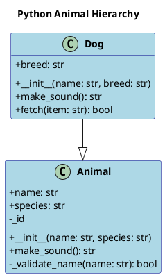
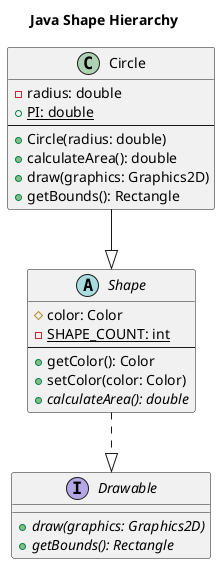

# DiagramGenerationAgent Guide

## Tổng quan

`DiagramGenerationAgent` là một agent chuyên dụng trong hệ thống DeepCode-Insight, có nhiệm vụ tạo ra các sơ đồ PlantUML từ thông tin AST (Abstract Syntax Tree) của mã nguồn. Agent này hỗ trợ cả Python và Java, có thể tạo ra class diagrams với đầy đủ thông tin về classes, fields, methods, và relationships.

## Tính năng chính

### 🎯 Class Information Extraction
- **Python Classes**: Trích xuất từ Python AST với support cho inheritance, methods, fields
- **Java Classes**: Hỗ trợ classes, interfaces, abstract classes với modifiers
- **Multi-format AST**: Xử lý được nhiều format AST khác nhau
- **Error Handling**: Graceful degradation khi gặp malformed data

### 🎨 PlantUML Diagram Generation
- **Class Diagrams**: Tạo sơ đồ lớp với đầy đủ thông tin
- **Inheritance Relationships**: Hiển thị inheritance và interface implementation
- **Configurable Output**: Tùy chỉnh hiển thị private members, parameters, field types
- **Styling**: Professional styling với colors và formatting

### 🔧 Configuration Options
- `include_private_members`: Hiển thị private fields/methods
- `include_method_parameters`: Hiển thị parameters trong methods
- `include_field_types`: Hiển thị type information cho fields
- `max_classes_per_diagram`: Giới hạn số classes per diagram

### 🔗 LangGraph Integration
- **State Management**: Tích hợp với LangGraph workflow
- **Batch Processing**: Xử lý multiple files cùng lúc
- **Metadata Tracking**: Theo dõi processing statistics

## Cấu trúc Data Classes

### ClassInfo
```python
@dataclass
class ClassInfo:
    name: str                    # Tên class
    file_path: str              # Đường dẫn file
    line_number: int            # Số dòng trong file
    is_abstract: bool = False   # Class abstract?
    is_interface: bool = False  # Interface?
    superclasses: List[str]     # Danh sách superclasses
    interfaces: List[str]       # Danh sách interfaces
    fields: List[FieldInfo]     # Danh sách fields
    methods: List[MethodInfo]   # Danh sách methods
    visibility: str = "public"  # Visibility modifier
```

### FieldInfo
```python
@dataclass
class FieldInfo:
    name: str                      # Tên field
    type_hint: str                 # Type annotation
    visibility: str = "public"     # public/private/protected
    is_static: bool = False        # Static field?
    is_final: bool = False         # Final field?
    default_value: Optional[str]   # Giá trị mặc định
```

### MethodInfo
```python
@dataclass
class MethodInfo:
    name: str                        # Tên method
    return_type: str                 # Return type
    parameters: List[ParameterInfo]  # Danh sách parameters
    visibility: str = "public"       # Visibility
    is_static: bool = False          # Static method?
    is_abstract: bool = False        # Abstract method?
    is_constructor: bool = False     # Constructor?
    is_destructor: bool = False      # Destructor?
```

## Cách sử dụng

### 1. Basic Usage

```python
from deepcode_insight.agents.diagram_generator import DiagramGenerationAgent

# Tạo agent với default settings
agent = DiagramGenerationAgent()

# Hoặc với custom configuration
agent = DiagramGenerationAgent(
    include_private_members=True,
    include_method_parameters=True,
    include_field_types=True,
    max_classes_per_diagram=10
)
```

### 2. Extract Class Information

```python
# Sample Python AST data
python_ast = {
    'classes': [
        {
            'name': 'Animal',
            'lineno': 1,
            'bases': [],
            'body': [
                {
                    'type': 'FunctionDef',
                    'name': '__init__',
                    'args': {
                        'args': [
                            {'arg': 'self'},
                            {'arg': 'name', 'annotation': {'id': 'str'}}
                        ]
                    },
                    'returns': None
                }
            ]
        }
    ]
}

# Extract class information
classes = agent.extract_class_info_from_ast(
    python_ast, 
    'animals.py', 
    'python'
)

print(f"Extracted {len(classes)} classes")
for cls in classes:
    print(f"- {cls.name}: {len(cls.methods)} methods, {len(cls.fields)} fields")
```

### 3. Generate PlantUML Diagrams

```python
# Generate class diagram
diagram = agent.generate_class_diagram(
    classes, 
    title="Animal Hierarchy",
    include_relationships=True
)

print("Generated PlantUML:")
print(diagram)
```

### 4. LangGraph Integration

```python
from deepcode_insight.agents.diagram_generator import diagram_generator_node

# Sample LangGraph state
state = {
    'ast_results': {
        'animals.py': python_ast,
        'shapes.java': java_ast
    }
}

# Process với LangGraph node
result = diagram_generator_node(state)

print(f"Status: {result['processing_status']}")
print(f"Generated diagrams: {list(result['diagrams'].keys())}")
```

## Sample Outputs

### Python Class Diagram


### Java Interface & Class Diagram


## Configuration Examples

### 1. Exclude Private Members
```python
agent = DiagramGenerationAgent(include_private_members=False)
diagram = agent.generate_class_diagram(classes)
# Sẽ không hiển thị private fields/methods
```

### 2. Simplified Method Display
```python
agent = DiagramGenerationAgent(include_method_parameters=False)
diagram = agent.generate_class_diagram(classes)
# Methods sẽ hiển thị như: + methodName() thay vì + methodName(param1: type)
```

### 3. Hide Field Types
```python
agent = DiagramGenerationAgent(include_field_types=False)
diagram = agent.generate_class_diagram(classes)
# Fields sẽ hiển thị như: + fieldName thay vì + fieldName: type
```

### 4. Limit Classes per Diagram
```python
agent = DiagramGenerationAgent(max_classes_per_diagram=5)
diagram = agent.generate_class_diagram(many_classes)
# Chỉ hiển thị 5 classes đầu tiên
```

## AST Format Support

### Python AST Formats

#### Direct Classes Format
```python
{
    'classes': [
        {
            'name': 'ClassName',
            'lineno': 1,
            'bases': [{'id': 'BaseClass'}],
            'body': [...]
        }
    ]
}
```

#### Full AST Format
```python
{
    'ast': {
        'body': [
            {
                'type': 'ClassDef',
                'name': 'ClassName',
                'lineno': 1,
                'bases': [...],
                'body': [...]
            }
        ]
    }
}
```

### Java AST Format
```python
{
    'classes': [
        {
            'type': 'class_declaration',  # hoặc 'interface_declaration'
            'name': 'ClassName',
            'start_point': {'row': 1},
            'modifiers': ['public', 'abstract'],
            'superclass': 'BaseClass',
            'interfaces': ['Interface1'],
            'body': [...]
        }
    ]
}
```

## Error Handling

### Graceful Degradation
- **Empty AST**: Trả về empty list
- **Malformed Data**: Tạo ClassInfo với default values
- **Missing Fields**: Sử dụng fallback values
- **Unsupported Language**: Log warning và return empty

### Error Scenarios
```python
# Empty AST
classes = agent.extract_class_info_from_ast({}, 'test.py', 'python')
# Result: []

# Unsupported language
classes = agent.extract_class_info_from_ast(ast_data, 'test.js', 'javascript')
# Result: [] với warning log

# Malformed class data
malformed_ast = {
    'classes': [{'invalid': 'data'}]
}
classes = agent.extract_class_info_from_ast(malformed_ast, 'test.py', 'python')
# Result: [ClassInfo(name='UnknownClass', ...)]
```

## Performance Considerations

### Memory Usage
- **Large Projects**: Sử dụng `max_classes_per_diagram` để limit memory
- **Batch Processing**: Process files individually để avoid memory spikes

### Processing Speed
- **AST Parsing**: O(n) complexity với n là số nodes
- **Diagram Generation**: O(m) với m là số classes
- **Relationship Extraction**: O(m²) worst case

### Optimization Tips
```python
# Cho large projects
agent = DiagramGenerationAgent(
    include_private_members=False,    # Reduce noise
    include_method_parameters=False,  # Simplify output
    max_classes_per_diagram=10       # Limit complexity
)

# Cho detailed analysis
agent = DiagramGenerationAgent(
    include_private_members=True,
    include_method_parameters=True,
    include_field_types=True
)
```

## Integration với Other Agents

### Workflow trong LangGraph
```
CodeFetcherAgent → ASTParsingAgent → DiagramGenerationAgent → ReportingAgent
```

### State Management
```python
# Input state từ ASTParsingAgent
{
    'ast_results': {
        'file1.py': {...},
        'file2.java': {...}
    }
}

# Output state cho ReportingAgent
{
    'diagrams': {
        'file1.py': {'type': 'class_diagram', 'uml': '...'},
        'file2.java': {'type': 'class_diagram', 'uml': '...'},
        'project_overview': {'type': 'class_diagram', 'uml': '...'}
    },
    'extracted_classes': [...],
    'diagram_metadata': {...}
}
```

## Testing

### Unit Tests
```bash
# Chạy all tests
python -m pytest deepcode_insight/tests/test_diagram_generator.py -v

# Chạy specific test group
python -m pytest deepcode_insight/tests/test_diagram_generator.py::TestDiagramGenerationAgent -v

# Chạy với coverage
python -m pytest deepcode_insight/tests/test_diagram_generator.py --cov=deepcode_insight.agents.diagram_generator
```

### Demo Script
```bash
# Chạy comprehensive demo
PYTHONPATH=/path/to/project python deepcode_insight/examples/diagram_generator_demo.py

# Chạy quick test
python deepcode_insight/test_quick_diagram.py
```

## Troubleshooting

### Common Issues

#### 1. Import Errors
```bash
# Solution: Set PYTHONPATH
export PYTHONPATH=/path/to/DeepCode-Insight
python your_script.py
```

#### 2. Empty Diagrams
```python
# Check AST data format
print(json.dumps(ast_data, indent=2))

# Verify language parameter
classes = agent.extract_class_info_from_ast(ast_data, 'file.py', 'python')  # not 'Python'
```

#### 3. Missing Relationships
```python
# Ensure classes are in same extraction
all_classes = []
for file_path, ast_data in ast_results.items():
    classes = agent.extract_class_info_from_ast(ast_data, file_path, language)
    all_classes.extend(classes)

# Generate combined diagram
diagram = agent.generate_class_diagram(all_classes, "Project Overview")
```

#### 4. Large Diagram Issues
```python
# Split into smaller diagrams
agent = DiagramGenerationAgent(max_classes_per_diagram=5)

# Or exclude private members
agent = DiagramGenerationAgent(include_private_members=False)
```

## Future Enhancements

### Planned Features
- **Sequence Diagrams**: Method call flow visualization
- **Package Diagrams**: Module/package structure
- **Dependency Graphs**: Import/dependency visualization
- **Interactive Diagrams**: Clickable elements với metadata

### Language Support
- **Kotlin**: Android development support
- **TypeScript**: Web development support
- **C#**: .NET ecosystem support

### Output Formats
- **Mermaid**: Alternative diagram format
- **SVG Export**: Direct image generation
- **Interactive HTML**: Web-based diagrams

## Conclusion

DiagramGenerationAgent là một powerful tool để tạo ra professional class diagrams từ source code analysis. Với support cho multiple languages, configurable output, và seamless LangGraph integration, nó là một component quan trọng trong DeepCode-Insight ecosystem.

Key benefits:
- ✅ **Multi-language Support**: Python và Java
- ✅ **Professional Output**: PlantUML với styling
- ✅ **Configurable**: Flexible display options
- ✅ **Robust**: Error handling và graceful degradation
- ✅ **Scalable**: Efficient processing cho large projects
- ✅ **Integrated**: Seamless LangGraph workflow 